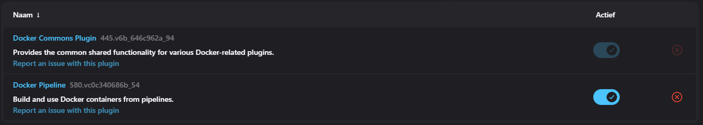
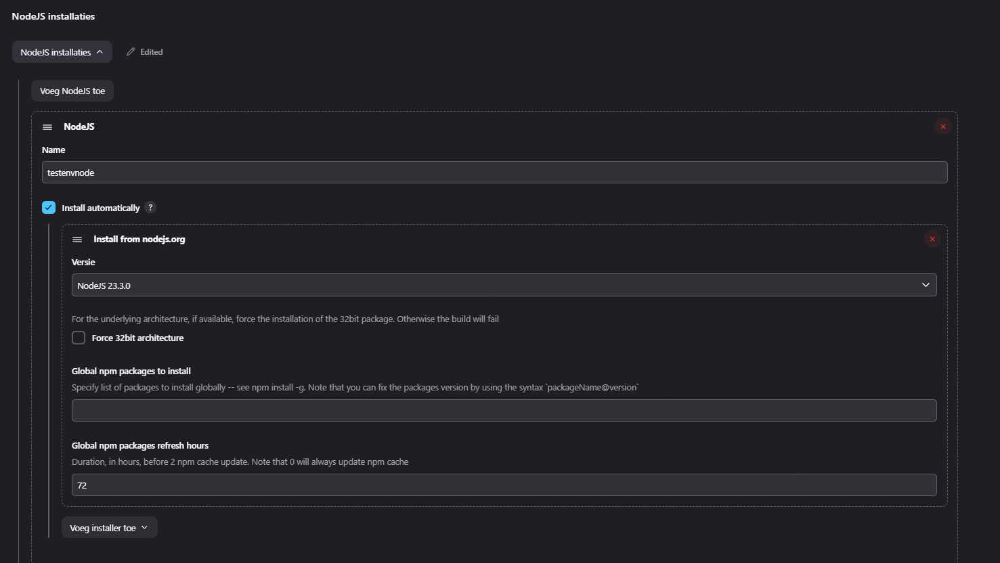
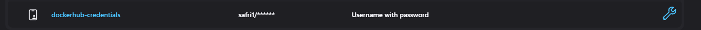

Vul onderstaande aan met de antwoorden op de vragen uit de readme.md file. Wil je de oplossingen file van opmaak voorzien? Gebruik dan [deze link](https://github.com/adam-p/markdown-here/wiki/Markdown-Cheatsheet) om informatie te krijgen over
opmaak met Markdown.

# A
## Configuration

### Jenkins Plugins



### Jenkins Tools



### Credentials



### Permissions
We moeten er zeker van zijn dat we docker kunnen gebruiken via de pipeline zonder sudo.
Dit doen we door de volgende commando in te voeren in de remote server waardat we de docker commando willen gebruiken:
`sudo usermod -aG docker ubuntu`
usermod is de commando om permissions toe te wijzen aan een gebruiker (ubuntu) op de gegeven commando (docker)
`-aG` zijn de permissies die we meegeven hiervoor.

## Stages
### Environment variables

```groovy
environment {
        DOCKERHUB_CREDENTIALS = credentials('dockerhub-credentials') 
    }
```
Hier worden uw dockerhub-credentials opgeslagen in de variable 'DOCKERHUB_CREDENTIALS'.


# B
## Configuratie

### Jenkins Plugins


Deze is nodig om `sshagent` te gebruiken

### Credentials


Maak een credential aan waarin je een private key plakt en de username ubuntu gebruikt.
!!! De naam van de credential moet `ssh-prod` heten.
Plak dan de public key in `/home/ubuntu/.ssh/authorized_keys`.
Dit zorgt er voor dat je vanuit jenkins toegang krijgt tot de remote server via SSH.

### Permissions
We moeten er zeker van zijn dat we docker kunnen gebruiken via de pipeline zonder sudo.
Dit doen we door de volgende commando in te voeren in de remote server waardat we de docker commando willen gebruiken:
`sudo usermod -aG docker ubuntu`
usermod is de commando om permissions toe te wijzen aan een gebruiker (ubuntu) op de gegeven commando (docker)
`-aG` zijn de permissies die we meegeven hiervoor.

## Pipeline
### Environment variables

```groovy
environment {
  PROD_SERVER_IP = '44.211.177.150'
  PROD_SERVER_USER = 'ubuntu'
}
```
Hier stellen wij de IP en User in van de remote server waarop we de deployment willen maken. Een environment variabel is noodzakelijk om manuele verandering te voorkomen op meerdere lijnen.
### Stages
#### Cleanup
```groovy
stage('cleanup') {
  steps {
      sshagent(credentials: ['ssh-prod']) {
          sh '''
              ssh -o StrictHostKeyChecking=no $PROD_SERVER_USER@$PROD_SERVER_IP '
              if [ "$(docker ps -a -q)" ]; then
                  docker stop $(docker ps -a -q)
                  docker rm $(docker ps -a -q)
              fi
  
              if [ "$(docker images -aq)" ]; then
                  docker rmi -f $(docker images -aq)
              fi
              '
          '''
      }
      cleanWs()
  }
  }
```
`sshagent(credentials: ['ssh-prod'])` 
Hier zeggen we welke ssh key we gebruiken voor de ssh agent.
`ssh -o StrictHostKeyChecking=no $PROD_SERVER_USER@$PROD_SERVER_IP`
Dit gaan we vaker terug zien. De `-o StrictHostKeyChecking=no` zorgt er voor dat we niet elke keer "yes" moeten typen wanneer de host niet gerecognised wordt.
`$PROD_SERVER_USER@$PROD_SERVER_IP` is voorzelf sprekend, dit is de user@ip van de remote server.
```groovy
if [ "$(docker ps -a -q)" ]; then
    docker stop $(docker ps -a -q)
    docker rm $(docker ps -a -q)
fi

if [ "$(docker images -aq)" ]; then
    docker rmi -f $(docker images -aq)
fi
```
We kijken of er running containers zijn, zo wel, dan gaan we die stoppen en verwijderen.
De reden voor een if statement hier is omdat de "stop" command minstens 1 argument verwacht.
Als er geen running container is, gooit deze een error.
Het zelfde geld voor de if statement daaronder, maar hier kijken we dan voor bestaande images.
`cleanWs()` is een Jenkins functie die de workspace cleaned. Het is in principe niet nodig, maar toch doen we het voor future cleanups, stel het zou nodig zijn.

### Deploy prod
```groovy
stage('deploy prod') {
    steps {
        sshagent(credentials: ['ssh-prod']) {
            sh '''
                ssh -o StrictHostKeyChecking=no $PROD_SERVER_USER@$PROD_SERVER_IP '
                docker pull safri1/calc-app-image
                '
            '''
        }
    }
}
```
Voorzelfsprekend. Wij pullen hier de image vanuit dockerhub.
Een belangrijke opmerking:
We gaan hier van uit dat de image publiek available is.
Dit betekent dus dat we niet hoeven in te loggen.
Stel de image zou private zijn, dan zouden we hier ook credentials voor moeten meegeven zoals in de `test.jenkinsfile` en inloggen op docker via de cli.

### Start prod
```groovy
stage('start prod') {
    steps {
        sshagent(credentials: ['ssh-prod']) {
            sh '''
                ssh -o StrictHostKeyChecking=no $PROD_SERVER_USER@$PROD_SERVER_IP '
                docker container run -d -p 80:3000 --name=PXLcalc-app-container safri1/calc-app-image
                '
            '''
        }
    }
}
```
We gaan de container detached runnen zodat het niet stopt nadat image succesvol is gerunned.
We portforwarden 3000 naar 80 zodat we via port 80 aan de applicatie kunnen via de browser (http).
We geven ook een naam voor duidelijkheid.

### Test prod
```groovy
stage('test prod') {
  steps {
      script {
          sleep(10) // wachten totdat we zeker zijn dat het is gedeployed.
          
          retry(3) { // retry mechanism
              def response = sh(
                  script: "curl -f -s -o /dev/null -w '%{http_code}' http://$PROD_SERVER_IP",
                  returnStatus: true
              )
              
              if (response != 0) {
                  error "Curl failed with exit code ${response}"
              }
              
              // Additional check to ensure 200 OK
              def httpCode = sh(
                  script: "curl -s -o /dev/null -w '%{http_code}' http://$PROD_SERVER_IP",
                  returnStdout: true
              ).trim()
              
              echo "HTTP status code: ${httpCode}"
              
              if (httpCode != '200') {
                  error "HTTP status code is not 200. Got ${httpCode}"
              }
          }
      }
  }
}
```

`sleep(10)` wordt als eerste uitgevoerd om zeker te zijn dat de app is gedeployed en beschikbaar is.
`retry(3)` is een tolerantie wat we meegeven. Als we een error krijgen, wordt het opnieuw geprobeerd.
We gebruiken curl en filteren de http code response eruit.
In principe is de `def response` functie genoeg om het na te checken, maar we hebben een additional check om er zeker van te zijn.
